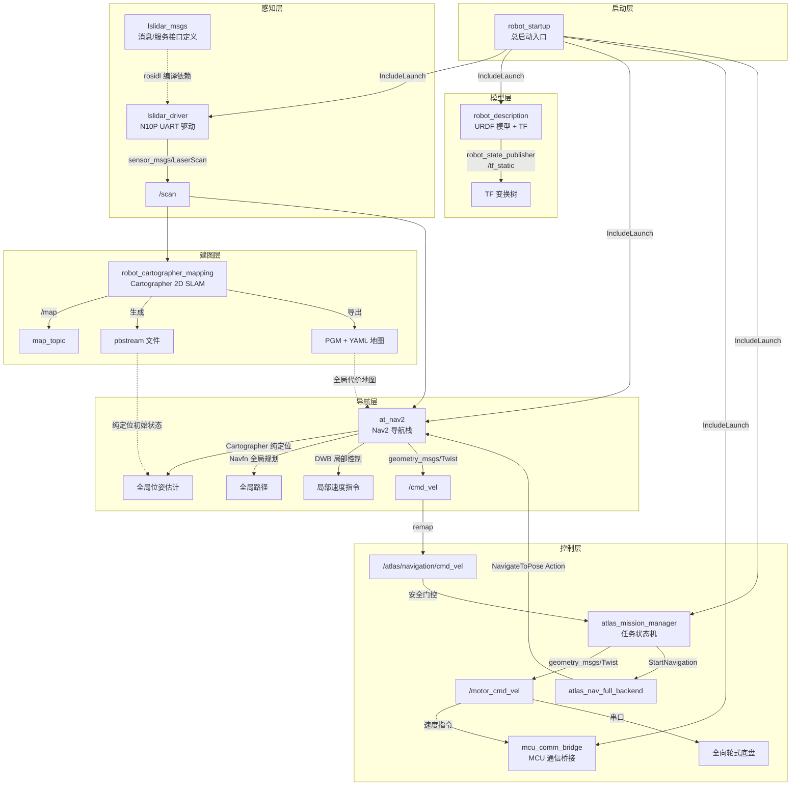

---

## Atlas 任务系统集成说明

当前导航目录同时保留两类后端：

| 后端 | 包 | 用途 |
| --- | --- | --- |
| `full` | `atlas_nav_full_backend` + `at_nav2` | 通过 Nav2 `NavigateToPose` 执行完整导航。 |
| `pseudo` | `atlas_nav_pseudo_backend` | 不依赖地图和定位，用 `/odom` 做相对位移联调。 |

完整任务栈默认使用：

```bash
ros2 launch atlas_mission_manager mission_stack.launch.py navigation_backend:=full
```

安全联调时可切换为：

```bash
ros2 launch atlas_mission_manager mission_stack.launch.py navigation_backend:=pseudo
```

注意：Nav2 原始 `/cmd_vel` 已在 `at_nav2/launch/at_nav.launch.py` 中 remap 到 `/atlas/navigation/cmd_vel`。最终到底层 MCU 的 `/motor_cmd_vel` 仍由 `atlas_mission_manager` 根据 AutoPi、任务阶段、Fault/EStop/Manual 等条件门控后发布。

# navigation_system — AGT 比赛轮式机器人导航系统

> **基于 ROS2 Humble、Nav2 和 Cartographer 的全栈导航系统**，覆盖从传感器驱动、SLAM 建图、路径规划到底层控制的完整机器人导航栈。

本系统面向 AGT 比赛场景，采用 **ROS2 Humble** 作为中间件框架，**Cartographer 2D 纯定位** 提供全局位姿估计，**Nav2（Navfn + DWB）** 负责全局规划与局部运动控制，**LSLIDAR N10P** 单线激光雷达为感知输入。

---

## 1. 系统架构



> 虚线表示编译时依赖或非实时数据流，实线表示运行时话题/服务通信。

---

## 2. 功能包清单

本 monorepo 包含 7 个功能包，按系统层次排列：

| 包名 | 定位 | 核心依赖 | 类型 |
|------|------|----------|------|
| [`lslidar_msgs`](./lslidar_msgs/) | 雷达消息与服务接口定义 | `builtin_interfaces`, `rosidl_default_generators` | 纯接口包 |
| [`lslidar_driver`](./lslidar_driver/) | LSLIDAR N10P UART 驱动节点 | `lslidar_msgs`, `rclcpp`, `sensor_msgs`, `pcl_conversions`, `libpcap` | 驱动包 |
| [`robot_description`](./robot_description/) | URDF 模型 + robot_state_publisher | `robot_state_publisher`, `rviz2` | 模型包 |
| [`robot_cartographer_mapping`](./robot_cartographer_mapping/) | Cartographer 2D SLAM 建图 | `cartographer_ros`, `nav2_map_server` | 建图包 |
| [`at_nav2`](./at_nav2/) | Nav2 导航栈 + Cartographer 纯定位 | `nav2_bringup`, `nav2_planner`, `nav2_controller`, `cartographer_ros` | 导航包 |
| [`atlas_nav_full_backend`](./atlas_nav_full_backend/) | 任务完整导航后端，包装 Nav2 `NavigateToPose` | `rclpy`, `nav2_msgs`, `atlas_mission_interfaces` | 适配包 |
| [`atlas_nav_pseudo_backend`](./atlas_nav_pseudo_backend/) | 伪导航后端，用于安全联调 | `rclpy`, `atlas_mission_interfaces` | 适配包 |
| [`robot_startup`](./robot_startup/) | PI 端总启动入口 | `mcu_comm_bridge`, `lslidar_driver`, `robot_description`, `atlas_mission_manager` | 启动包 |

> `mcu_comm_bridge` 为底盘驱动桥接外部依赖包，不在本目录中。

---

## 3. 快速开始

### 3.1 环境准备

在 Ubuntu 22.04 上安装必需的系统依赖和 ROS2 包：

```bash
# 系统依赖
sudo apt install -y build-essential cmake git python3-colcon-common-extensions \
  python3-rosdep libpcl-dev libpcap-dev libyaml-cpp-dev libboost-all-dev

# ROS2 Humble 核心包
sudo apt install -y ros-humble-desktop ros-humble-rosidl-default-generators

# 导航栈
sudo apt install -y ros-humble-navigation2 ros-humble-nav2-bringup \
  ros-humble-nav2-map-server ros-humble-nav2-planner ros-humble-nav2-controller

# Cartographer
sudo apt install -y ros-humble-cartographer ros-humble-cartographer-ros

# TF 与可视化
sudo apt install -y ros-humble-robot-state-publisher ros-humble-rviz2

# 依赖初始化
sudo rosdep init && rosdep update
```

### 3.2 克隆与构建

```bash
# 创建工作空间
mkdir -p ~/chassis-pi-ws/src
cd ~/chassis-pi-ws

# 克隆本仓库
# 如果已经位于 Atlas/chassis-pi-ws，可直接跳过 clone
# git clone <repo-url> src/Atlas

# 安装所有依赖
rosdep install --from-paths src --ignore-src -r -y

# 构建全部包
colcon build --symlink-install
source install/setup.bash
```

### 3.3 真机建图

启动 Cartographer 建图（含雷达、MCU 桥接、TF）：

```bash
source ~/chassis-pi-ws/install/setup.bash
ros2 launch robot_cartographer_mapping robot_cartographer_mapping.launch.py
```

用键盘/手柄遥控机器人在场地中移动，覆盖目标区域后保存地图：

```bash
# 保存 pbstream（用于后续纯定位）
ros2 service call /write_state cartographer_ros_msgs/srv/WriteState \
  "{filename: '$(pwd)/my_map.pbstream'}"

# 导出 PGM + YAML（用于 Nav2 全局代价地图）
ros2 run nav2_map_server map_saver_cli -t map -f my_map
```

### 3.4 真机导航

将建图产物（`my_map.pbstream`、`my_map.pgm`、`my_map.yaml`）放入 `at_nav2/maps/` 目录，并在 `at_nav.launch.py` 中指定这些文件后，一键启动：

```bash
source ~/chassis-pi-ws/install/setup.bash
ros2 launch robot_startup robot_start.launch.py
```

该 launch 文件会拉起：
1. `mcu_comm_bridge` — MCU 通信桥接，提供 `/odom`、`/imu`、机械臂状态和 `/motor_cmd_vel` 输入
2. `lslidar_driver` — N10P 雷达驱动，提供 `/scan`
3. `robot_description` — URDF + TF 发布
4. `atlas_mission_manager` — 任务状态机、完整导航后端和 RACOM 视觉作业链路
5. `at_nav2` — 由 `mission_stack.launch.py` 在 `navigation_backend:=full` 时启动

---

## 4. 核心数据流

| Topic | 发布者 | 订阅者 | 说明 |
|-------|--------|--------|------|
| `/scan` | `lslidar_driver` | `cartographer_node`, `nav2_costmap_2d` | N10P 单线激光扫描数据（sensor_msgs/LaserScan） |
| `/odom` | 底盘里程计 / MCU 桥接 | `cartographer_node`, `nav2_controller` | 轮式里程计，提供局部运动估计（nav_msgs/Odometry） |
| `/map` | `cartographer_node` | `nav2_costmap_2d`（global costmap） | SLAM 生成的占据栅格地图（nav_msgs/OccupancyGrid） |
| `/atlas/navigation/cmd_vel` | `nav2_controller` 经 remap | `atlas_mission_manager` | Nav2 输出的导航速度，先进入任务安全门控 |
| `/motor_cmd_vel` | `atlas_mission_manager` | `mcu_comm_bridge` | 门控后的底盘实际速度指令 |
| `/joint_states` | 底盘编码器 / MCU 桥接 | `robot_state_publisher` | 各关节状态（sensor_msgs/JointState），驱动 TF 动态发布 |
| `map -> odom` TF | `cartographer_node` | `robot_state_publisher` / `nav2_controller` | 全局定位修正变换 |
| `odom -> base_footprint` TF | 里程计节点 | `robot_state_publisher` / `nav2_costmap_2d` | 局部运动估计变换 |
| `base_link -> laser_link` TF | `robot_state_publisher`（URDF static） | `cartographer_node`, `nav2_costmap_2d` | LiDAR 传感器安装位姿（fixed joint） |

> TF 完整链路：`map -> odom -> base_footprint -> base_link -> laser_link`（及各轮段）

---

## 5. 硬件/软件要求

| 类别 | 项目 | 要求 |
|------|------|------|
| **操作系统** | Ubuntu | 22.04 LTS（Jammy） |
| **ROS2** | Humble Hawksbill | 桌面完整版（desktop） |
| **编译器** | GCC / Clang | C++17 标准 |
| **脚本语言** | Python | 3.10+（含 typing） |
| **雷达** | LSLIDAR N10P | 单线激光雷达，UART 串口通信 |
| **底盘** | 全向轮式底盘 | 四轮独立转向 + 独立驱动 |
| **MCU** | MCU 通信桥接 | `mcu_comm_bridge` 包（串口 / CAN） |
| **构建系统** | colcon | 需 `--symlink-install` 支持 |

---

## 6. 完整目录树

```
navigation_system/
├── README.md                                 # 本文档（总入口）
│
├── lslidar_msgs/                             # 雷达消息/服务接口包
│   ├── msg/                                  #   自定义消息（LslidarInformation, LslidarPacket）
│   ├── srv/                                  #   自定义服务（IpAndPort, MotorControl, TimeMode 等 11 项）
│   ├── CMakeLists.txt
│   ├── package.xml
│   └── README.md
│
├── lslidar_driver/                           # 雷达驱动包（N10P UART）
│   ├── config/                               #   雷达参数 YAML 配置
│   ├── include/lslidar_driver/               #   头文件（点云类型定义、驱动核心）
│   ├── launch/                               #   启动文件
│   ├── src/                                  #   驱动源码
│   ├── CMakeLists.txt
│   ├── package.xml
│   └── README.md
│
├── robot_description/                        # URDF 模型与 TF
│   ├── urdf/                                 #   robot_description.urdf
│   ├── meshes/                               #   STL 网格（底盘、车轮、LiDAR 支架）
│   ├── launch/                               #   robot_description.launch.py
│   ├── CMakeLists.txt
│   ├── package.xml
│   └── README.md
│
├── robot_cartographer_mapping/               # Cartographer 2D SLAM 建图
│   ├── config/                               #   robot_2d.lua（SLAM 参数）
│   ├── launch/                               #   robot_cartographer_mapping.launch.py
│   ├── CMakeLists.txt
│   ├── package.xml
│   └── README.md
│
├── at_nav2/                                  # Nav2 导航栈 + Cartographer 纯定位
│   ├── config/                               #   Nav2 参数 + BT XML + Cartographer 定位 LUA
│   ├── launch/                               #   at_nav.launch.py
│   ├── maps/                                 #   导航用地图（ruikang.pbstream/pgm/yaml）
│   ├── rviz2/                                #   RViz2 可视化配置（预留）
│   ├── CMakeLists.txt
│   ├── package.xml
│   └── README.md
│
├── robot_startup/                            # 总启动入口
│   ├── launch/                               #   robot_start.launch.py
│   ├── CMakeLists.txt
│   ├── package.xml
│   └── README.md
│
├── atlas_nav_full_backend/                   # 完整导航后端适配器
│   ├── config/full_nav.yaml
│   ├── launch/full_nav_backend.launch.py
│   └── README.md
│
├── atlas_nav_pseudo_backend/                 # 伪导航后端
│   ├── config/pseudo_nav.yaml
│   ├── launch/pseudo_nav.launch.py
│   └── README.md
│
└── robot_startup/                            # PI 端总启动入口
    ├── launch/robot_start.launch.py
    ├── CMakeLists.txt
    ├── package.xml
    └── README.md
```

---

## 7. 维护者

**AGT Dev Team** — 竞赛机器人导航系统开发与维护。

如有问题或建议，请提交 Issue 或通过仓库联系。

---

## 8. 相关链接

| 资源 | 链接 |
|------|------|
| Navigation2 文档 | https://docs.nav2.org |
| Nav2 GitHub | https://github.com/ros-navigation/navigation2 |
| Cartographer ROS 文档 | https://google-cartographer-ros.readthedocs.io |
| Cartographer GitHub | https://github.com/cartographer-project/cartographer_ros |
| LSLIDAR 官方 | https://www.lslidar.com |
| ROS2 Humble 文档 | https://docs.ros.org/en/humble |
| ROS2 TF2 教程 | https://docs.ros.org/en/humble/Tutorials/Intermediate/Tf2 |
