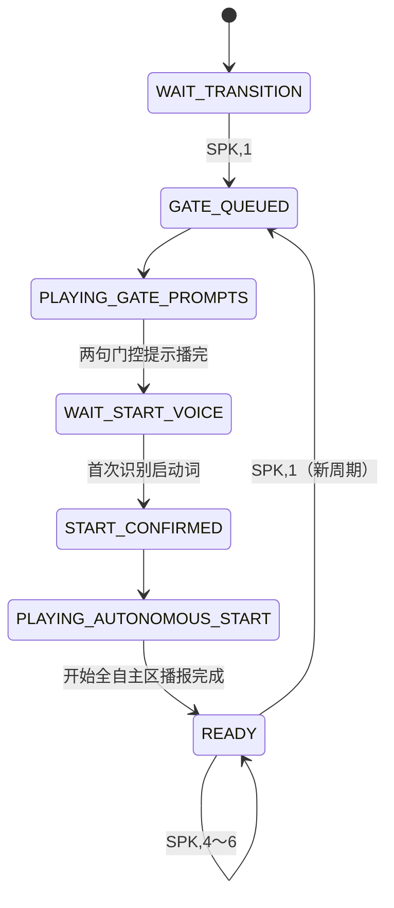
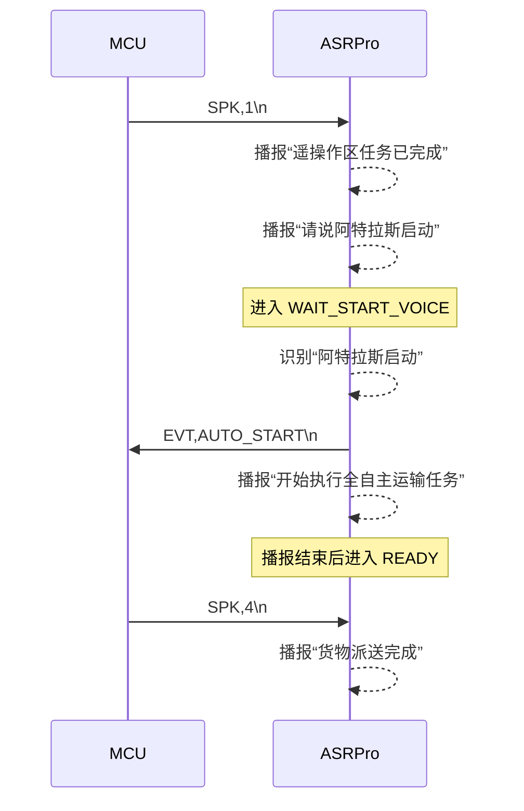

# Atlas MCU–ASRPro 一次性语音启动通信协议

> 协议版本：V1.2  
> 固件：`atlas_asrpro_voice_gate_return_v1_2_20260729.hd`  
> 串口：115200 8N1  
> 编码：ASCII  
> 帧结束符：`\n`，兼容 `\r\n`  
> 通信模型：最小双向、无握手、无心跳、无 ACK、无自动重发

---

## 1. 协议目标

ASRPro 负责两类功能：

1. 固定语音播报。
2. 在 MCU 明确通知“遥操作区完成”之后，开放一次“阿特拉斯启动”识别，并将识别结果返回 MCU。

ASRPro 不负责：

- 底盘安全。
- 急停判断。
- 自动任务执行。
- MCU 在线判断。
- 树莓派在线判断。
- 周期性状态上报。
- ACK/NACK。
- 命令重发。

---

## 2. 完整业务顺序

```text
ASRPro 上电
  ↓
等待 MCU 的 SPK,1
  ↓
MCU → ASRPro：SPK,1
  ↓
ASRPro 播报“遥操作区任务已完成”
  ↓
ASRPro 播报“请说阿特拉斯启动”
  ↓
ASRPro 开放一次启动词识别
  ↓
识别到“阿特拉斯启动”
  ↓
ASRPro → MCU：EVT,AUTO_START
  ↓
ASRPro 播报“开始执行全自主运输任务”
  ↓
播报完成后进入 READY
  ↓
才允许 MCU 发送 SPK,4～6
```

关键点：

- `SPK,1` 之前的任何识别结果均被忽略。
- 两句门控提示播完之前的识别结果均被忽略。
- 一个任务周期只接受一次启动识别。
- 启动识别成功后立即返回一次 `EVT,AUTO_START`。
- “开始执行全自主运输任务”播完后，才允许普通播报。
- READY 状态再次收到 `SPK,1`，开始下一个任务周期。

---

## 3. 物理连接

由于 ASRPro 需要返回启动事件，必须连接双向 UART：

```text
MCU UART_TX  ─────────→  ASRPro UART_RX
MCU UART_RX  ←─────────  ASRPro UART_TX
MCU GND      ──────────  ASRPro GND
```

双方电平必须兼容。

---

## 4. MCU → ASRPro 命令

### 4.1 启动语音门控周期

```text
SPK,1\n
```

含义：

- 遥操作区已完成。
- ASRPro 开始执行门控播报。
- 门控播报结束后只开放一次“阿特拉斯启动”识别。

只有以下状态接受：

```text
WAIT_TRANSITION
READY
```

在其他状态重复发送会被忽略。

---

### 4.2 货物派送完成

```text
SPK,4\n
```

仅在 `READY` 状态有效。

---

### 4.3 全自主任务结束

```text
SPK,5\n
```

仅在 `READY` 状态有效。

---

### 4.4 当前阶段跳过

```text
SPK,6\n
```

仅在 `READY` 状态有效。

---

## 5. 不再由 MCU 发送的编号

以下语句由 ASRPro 门控流程内部自动播报：

```text
SPK,2
SPK,3
```

因此 MCU 不应发送它们。

即使收到，ASRPro 也会忽略。

内部映射：

| 内部 phrase_id | 播报 |
|---:|---|
| 2 | 请说阿特拉斯启动 |
| 3 | 开始执行全自主运输任务 |

---

## 6. ASRPro → MCU 事件

### 6.1 启动口令识别成功

```text
EVT,AUTO_START\n
```

触发条件必须同时满足：

1. 当前状态为 `WAIT_START_VOICE`。
2. 识别结果为“阿特拉斯启动”。
3. 本任务周期尚未发送过该事件。

事件含义：

```text
本周期一次性启动口令已识别成功
```

MCU 收到后可以：

- 锁存语音启动结果。
- 通知树莓派进入全自主任务。
- 切换对应应用状态。

MCU不应把该事件当作底盘安全许可；底盘安全仍由 MCU 自身条件判断。

---

## 7. 返回事件时机

V1.2 规定：

```text
识别成功后立即发送 EVT,AUTO_START
```

然后 ASRPro 播报：

```text
开始执行全自主运输任务
```

在该播报结束前：

```text
SPK,4
SPK,5
SPK,6
```

仍会被忽略。

这样可以同时保证：

- MCU 能及时收到识别结果。
- 后续普通播报不会插入“开始全自主区”之前。

---

## 8. ASRPro 状态机



---

## 9. 一次性识别规则

识别引擎可以持续运行，但固件只在以下状态处理启动词：

```text
WAIT_START_VOICE
```

首次有效识别后立即切换为：

```text
START_CONFIRMED
```

因此连续回调、重复识别或环境回声不会重复触发事件。

同一周期：

```text
EVT,AUTO_START
```

最多发送一次。

下一个周期必须重新收到：

```text
SPK,1
```

---

## 10. 识别 ID

固件默认：

```cpp
#define ATLAS_START_INTENT_SNID 1U
```

ASRPro 工程中的命令词必须配置为：

```text
阿特拉斯启动 -> snid = 1
```

如果实际工程生成的识别 ID 不是 `1`，必须同步修改宏：

```cpp
#define ATLAS_START_INTENT_SNID <实际ID>
```

否则不会触发启动事件。

---

## 11. 完整时序



---

## 12. MCU 接收示例

MCU 按行解析 ASRPro 返回：

```c
void asrpro_handle_line(const char *line)
{
    if (line == NULL) {
        return;
    }

    if (strcmp(line, "EVT,AUTO_START") == 0) {
        app_on_voice_auto_start();
    }
}
```

建议 MCU 在当前任务周期内再做一次本地锁存：

```c
static bool voice_start_latched = false;

void app_on_voice_auto_start(void)
{
    if (voice_start_latched) {
        return;
    }

    voice_start_latched = true;

    // 通知树莓派或进入全自主任务准备状态。
}
```

新任务周期开始或系统复位时：

```c
voice_start_latched = false;
```

---

## 13. MCU 发送示例

```c
void asrpro_notify_teleop_complete(void)
{
    static const char command[] = "SPK,1\n";

    uart_send_nonblocking(
        ASRPRO_UART,
        (const uint8_t *)command,
        sizeof(command) - 1U
    );
}
```

普通播报：

```c
void asrpro_speak(uint16_t phrase_id)
{
    if (phrase_id != 4U &&
        phrase_id != 5U &&
        phrase_id != 6U) {
        return;
    }

    char command[16];

    int length = snprintf(
        command,
        sizeof(command),
        "SPK,%u\n",
        (unsigned int)phrase_id
    );

    if (length <= 0 ||
        length >= (int)sizeof(command)) {
        return;
    }

    uart_send_nonblocking(
        ASRPRO_UART,
        (const uint8_t *)command,
        (size_t)length
    );
}
```

---

## 14. 无 ACK 与无重发规则

协议仍然没有 ACK。

MCU 不应执行：

```text
未收到 ACK 就重复发送 SPK,1
```

因为本协议根本没有 ACK。

建议：

- MCU 每个“遥操作区完成”事件只发送一次 `SPK,1`。
- MCU 不周期性重发。
- ASRPro 不对 `SPK` 命令返回确认。
- `EVT,AUTO_START` 不要求 MCU 返回确认。
- ASRPro 不自动重发 `EVT,AUTO_START`。

若 MCU 丢失一次启动事件，本任务周期不会自动补发。该取舍用于保持协议最小化。

---

## 15. 非法或越权命令

| 输入或行为 | ASRPro 处理 |
|---|---|
| 上电后直接语音启动 | 忽略 |
| 门控提示播完前识别启动词 | 忽略 |
| 同周期第二次识别启动词 | 忽略 |
| 非 READY 状态发送 `SPK,4～6` | 忽略 |
| MCU 发送 `SPK,2` | 忽略 |
| MCU 发送 `SPK,3` | 忽略 |
| `SPK,0` 或 `SPK,7` | 忽略 |
| 非法 ASCII 行 | 忽略 |
| 超长行 | 丢弃整行 |
| 重复 `SPK,1` | 门控进行中时忽略 |

所有非法输入均不返回错误。

---

## 16. ASRPro 断电或异常

ASRPro 是任务启动交互外设，而不是底盘安全设备。

ASRPro 异常时：

- MCU 不应进入底盘硬件故障。
- 遥控和急停必须仍然工作。
- MCU 收不到 `EVT,AUTO_START`，因此本次语音启动条件不会成立。
- 可以由人工重新发起任务周期或采用其他授权启动方式。

---

## 17. 测试用例

### 17.1 上电直接识别

操作：

```text
不发送 SPK,1，直接说“阿特拉斯启动”
```

预期：

- 无播报。
- 无 `EVT,AUTO_START`。

### 17.2 正常流程

操作：

```text
MCU 发送 SPK,1
等待两句提示播完
说“阿特拉斯启动”
```

预期：

1. 播报遥操作区完成。
2. 播报语音提示。
3. 返回一次 `EVT,AUTO_START`。
4. 播报开始全自主任务。
5. 进入 READY。

### 17.3 门控提示期间提前说启动词

预期：

- 识别结果被忽略。
- 必须等提示播完后重新说。

### 17.4 连续说两次启动词

预期：

```text
EVT,AUTO_START
```

只返回一次。

### 17.5 启动播报期间发送 SPK,4

预期：

- `SPK,4` 被忽略。
- 不得插入到“开始全自主任务”播报之前。

### 17.6 READY 后发送 SPK,4

预期：

- 正常播报“货物派送完成”。

### 17.7 下一周期

操作：

```text
READY 状态发送 SPK,1
```

预期：

- 清除上一周期的一次性识别锁存。
- 重新开始门控流程。
- 下一周期仍最多返回一次启动事件。

---

## 18. 协议摘要

```text
版本：V1.2
UART：115200 8N1
编码：ASCII
结束符：\n

MCU -> ASRPro：
  SPK,1
  SPK,4
  SPK,5
  SPK,6

ASRPro -> MCU：
  EVT,AUTO_START

握手：无
心跳：无
ACK：无
NACK：无
自动重发：无
启动识别：每个 SPK,1 周期一次
普通播报开放：开始全自主区播报完成后
```
