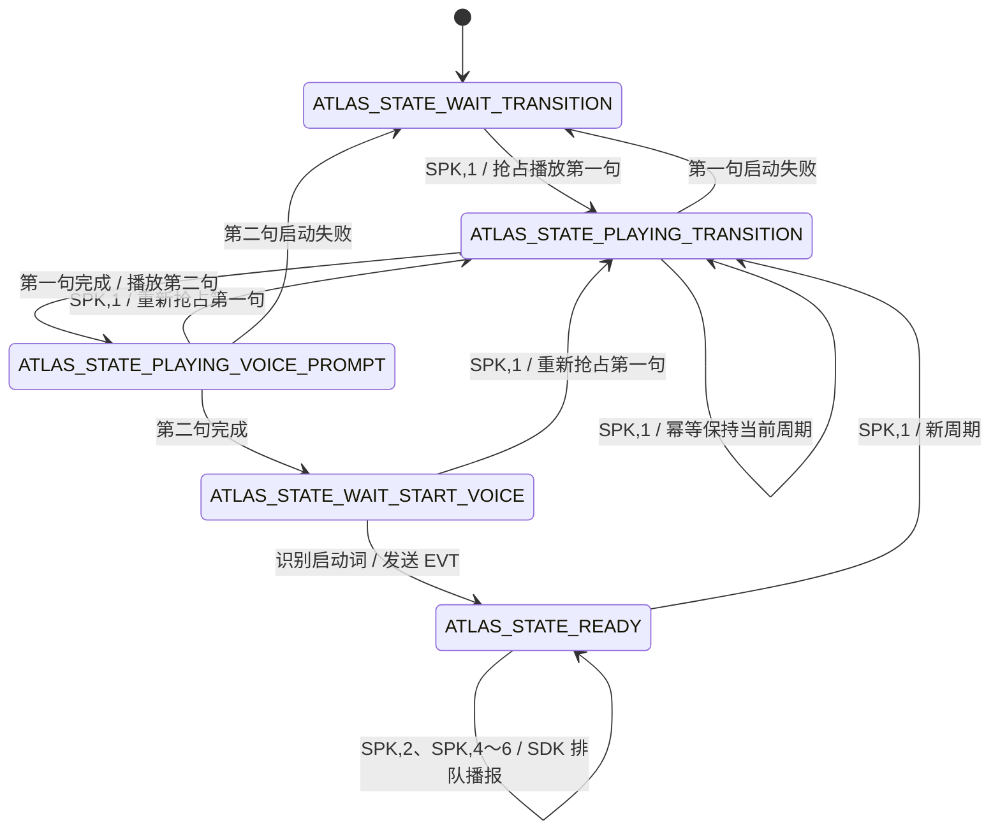
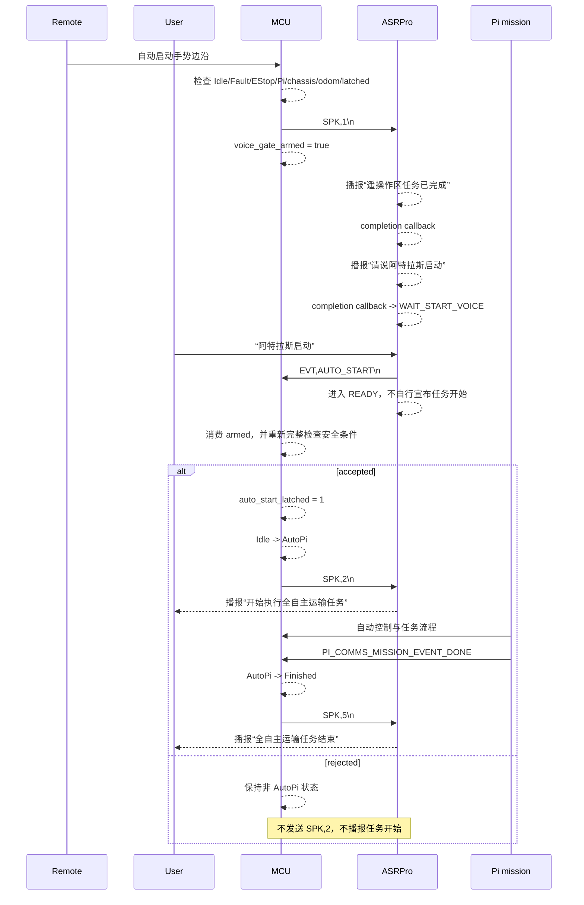

# Atlas ASRPro ↔ MCU 最小双向串口协议

> 协议版本：V1.4
> ASRPro 固件：`atlas_asrpro/atlas_asrpro.hd`
> MCU：STM32H723VGTX
> 通信模型：最小双向 ASCII UART

## 1. 架构与职责

```text
遥控器 ──> MCU ── UART8 ──> ASRPro
                 <──────────
```

ASRPro 是非关键语音交互外设，只负责：

- 固定语音播报
- 一次性“阿特拉斯启动”识别门控
- 向 MCU 返回 `EVT,AUTO_START`

MCU 是系统状态和安全权威，负责决定何时开启语音门控、是否接受语音事件以及是否执行 `Idle -> AutoPi`

Pi/YASMIN 不直接连接 ASRPro，不检查 ASRPro 在线状态，不等待播报完成，ASRPro 也不进入 Pi/YASMIN 状态图

ASRPro 不负责底盘安全、EStop、Fault、Pi 在线状态、底盘/里程计 ready、任务状态或状态机切换

## 2. UART 与接线

| 项目 | 配置 |
|---|---|
| MCU 外设 | UART8，异步 TX/RX |
| 波特率 | 115200 |
| 数据格式 | 8 data bits，1 stop bit，no parity，no flow control |
| 编码 | ASCII |
| 行结束符 | `\n`，接收兼容 `\r\n` |

```text
MCU PE1 / UART8_TX  ───> ASRPro RX
MCU PE0 / UART8_RX  <─── ASRPro TX
MCU GND              ─── ASRPro GND
```

双方串口电平必须兼容并共地

## 3. MCU -> ASRPro

| 命令 | 含义 | 接受条件 |
|---|---|---|
| `SPK,1\n` | 开始或重新开始一次语音启动门控 | `PLAYING_TRANSITION` 中幂等；其余状态抢占当前播报并清理 SDK 播放队列 |
| `SPK,2\n` | MCU 已正式接受自动任务启动，播报“开始执行全自主运输任务” | 仅 `READY` |
| `SPK,4\n` | 播报“货物派送完成” | 仅 `READY` |
| `SPK,5\n` | 播报“全自主运输任务结束” | 仅 `READY` |
| `SPK,6\n` | 播报“当前阶段已跳过” | 仅 `READY` |

`SPK,1` 每次只发送一次，不周期重发；除第一句正在播放时保持当前周期外，它会从“遥操作区任务已完成”重新开始完整门控周期，因此 MCU 不需要单独的 ASRPro RESET 命令

`SPK,2` 只在 MCU 完成全部安全复核并实际进入 `AutoPi` 后 best-effort 发送；它是业务播报命令，不是 ACK，也不参与 ASR 识别门控

`SPK,4` 和 `SPK,6` 当前只保留 MCU 发送能力，尚未绑定上游业务事件；不得为使用它们修改 MCU ↔ Pi 协议或提前实现 YASMIN

## 4. ASRPro -> MCU

| 事件 | 含义 |
|---|---|
| `EVT,AUTO_START\n` | 用户在已开放的本周期门控内完成一次有效“阿特拉斯启动”输入 |

一个 `SPK,1` 周期最多产生一次 `EVT,AUTO_START`

该事件不是机器人安全许可，也不表示机器人已经进入自动运行；MCU 必须先确认本地 `voice_gate_armed`，再调用现有 `app_runtime_try_accept_auto_start_event()` 完成最终安全检查

## 5. ASRPro 状态机

Prompt Player 接口是非阻塞接口，每个播放请求只调用一次；门控流程由 SDK 播放完成 callback 驱动，callback 签名为 `void callback(cmd_handle_t cmd_handle)`



状态语义：

1. 上电处于 `ATLAS_STATE_WAIT_TRANSITION`
2. `SPK,1` 抢占当前播报，播放“遥操作区任务已完成”；若该句已经在播放，则保持当前周期且不重新调用播放器
3. 第一句完成 callback 播放“请说阿特拉斯启动”
4. 第二句完成后才进入 `ATLAS_STATE_WAIT_START_VOICE`
5. 仅在该状态且 `snid == ATLAS_START_INTENT_SNID` 时离开门控、进入 `ATLAS_STATE_READY` 并发送一次事件
6. ASRPro 不根据识别结果自行宣布任务开始；仅在 `READY` 收到 MCU 的 `SPK,2` 后播报“开始执行全自主运输任务”
7. 门控播报启动失败回到 `ATLAS_STATE_WAIT_TRANSITION`

Prompt Player 官方文档说明抢占会清理播放队列，但没有说明被抢占请求是否还会触发 completion callback；为避免旧 callback 推进刚重启的新周期，第一句播放中的重复 `SPK,1` 采用保守幂等语义

默认识别 ID：

```cpp
#define ATLAS_START_INTENT_SNID 1U
```

ASRPro 工程必须配置“阿特拉斯启动”对应相同 `snid`

## 6. 完整自动启动时序



## 7. MCU 安全规则

遥控自动手势只请求开启一次语音门控，不直接设置 `auto_start_latched`，也不直接切换 `AutoPi`

开启门控前和收到事件后都检查：

- 当前状态为 `Idle`
- `auto_start_latched == 0`
- 无锁存 Fault
- 非 EStop
- Pi online
- chassis ready
- odom ready

收到 `EVT,AUTO_START` 时 MCU 先检查本地 `voice_gate_armed`；未武装事件直接忽略；已武装事件会先消费本周期 armed，再调用 `app_runtime_try_accept_auto_start_event()` 重新检查全部条件

只有 AutoPi 事件投递成功且 MCU 已实际进入 `AutoPi`，才 best-effort 发送 `SPK,2`；复核拒绝时不发送；`SPK,2` 发送失败只记录日志，不回滚 `AutoPi`、不清除锁存，也不产生 Fault

Manual 请求优先级高于 ASR 事件；进入 Manual、Fault 或 EStop 后，晚到事件不能切换到 `AutoPi`

以下情况清除 `voice_gate_armed` 和 pending ASR 事件：

- 初始化或遥控 clear/reset
- 切回 Manual
- 进入 Fault 或 EStop
- ASR 自动启动事件被消费
- 任务 DONE 或 FAIL

## 8. 故障与降级规则

ASRPro 是非关键外设：

- ASRPro 断开不产生 MCU Fault
- ASRPro 断开不影响 Manual
- ASRPro 断开不影响 EStop
- ASRPro 断开不影响 PC 控制或 MCU ↔ Pi 链路
- ASRPro 串口错误只重新启动 UART8 单字节接收
- 本周期若无法获得 `EVT,AUTO_START`，则无法通过语音完成 `AutoPi` 启动
- 播报命令发送失败只记录日志，不改变任务状态

## 9. 无 ACK 原则

本协议明确不包含：

- handshake 或 HELLO
- heartbeat 或在线检测
- ACK / NACK
- CRC
- sequence
- 版本协商
- 自动重发

非法行、未知命令和超长行均直接丢弃，不返回错误

`SPK,2` 是 MCU 授权后的单向业务播报，不是对 `EVT,AUTO_START` 的协议 ACK

## 10. Reset 与重启

MCU 不发送专门 RESET 命令；新的 `SPK,1` 可从 ASRPro 任意内部状态发起；第一句播放中保持当前周期，其余状态使用抢占播放清理旧 SDK 播放队列，并重新从“遥操作区任务已完成”开始门控周期

MCU reset 后只需在下一次合法遥控手势时发送新的 `SPK,1`

## 11. 接收边界

双方均按 `\n` 分行并兼容 `\r\n`

- ASRPro 最大接收行长度为 32 字节量级
- MCU 使用固定长度 ring buffer 和 32 字节行缓冲
- UART ISR 只喂入字节并重新启动单字节接收
- 字符串比较在 MCU 100 Hz `asr_comms_process()` 中完成
- 超长行从溢出处丢弃到下一换行符
- 无动态内存分配

## 12. 验证要点

1. 未发送 `SPK,1` 时说启动词，不产生事件
2. 两句门控提示完成前说启动词，不产生事件
3. 提示完成后首次说启动词，只产生一次事件
4. 有效识别后 ASRPro 直接进入 `READY`，不自行播放“开始执行全自主运输任务”
5. `PLAYING_TRANSITION` 中重复 `SPK,1` 不重新调用播放器；其余中间状态收到新 `SPK,1` 时从第一句重新开始
6. MCU 未 armed、复核失败或 Manual 优先时，不进入 `AutoPi` 且不发送 `SPK,2`
7. MCU 实际进入 `AutoPi` 后发送一次 `SPK,2`；发送失败不回滚状态或产生 Fault
8. `READY` 中的 `SPK,2`、`SPK,4`、`SPK,5`、`SPK,6` 均只进入 SDK 播放队列
9. ASRPro 断电时 MCU、Manual、PC 和 EStop 保持正常
