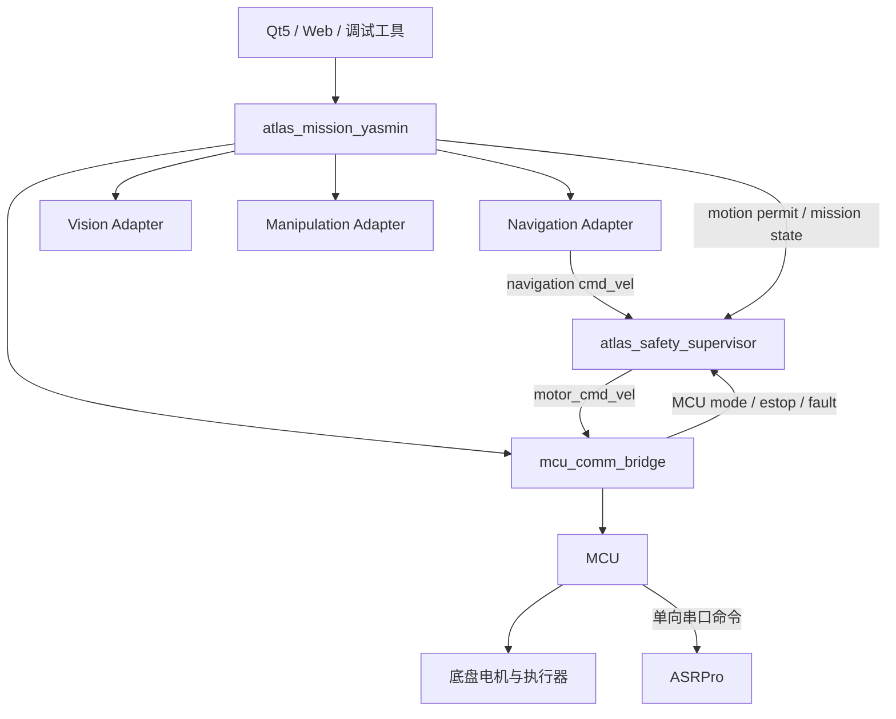
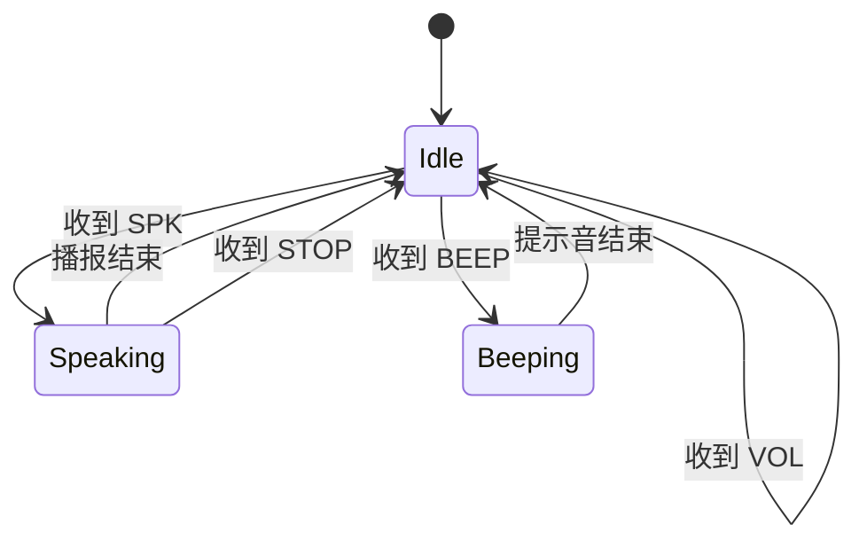
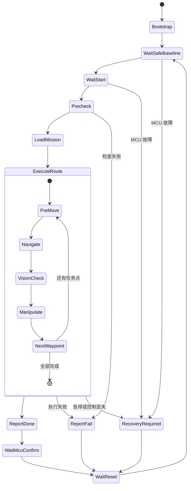

# Atlas 底盘端重构完整计划

> 适用范围：`AgroTech-SCAU/Steering-Wheel-Chassis/Atlas`  
> 重点对象：`chassis-pi-ws`、MCU 通信、ASRPro、导航/视觉/机械臂任务编排  
> 日期：2026-07-28

---

## 1. 重构目标

本次重构不是继续给现有系统叠加功能，而是先解决以下问题：

1. `chassis-pi-ws` 中存在多套任务管理逻辑，职责重复。
2. 导航、视觉、机械臂、语音和底盘通信互相直接依赖。
3. 启动文件承担过多业务逻辑，并依赖固定延时启动。
4. `/cmd_vel`、`/motor_cmd_vel` 和任务管理器之间的控制链不统一。
5. ASRPro 逻辑过重，包含不必要的握手、心跳、确认和状态维护。
6. 当前手写状态机逐渐膨胀，后续增加任务会继续恶化。

最终目标是形成：

- MCU 负责底盘实时控制、安全状态和执行权限。
- 树莓派负责导航、视觉、机械臂任务和业务流程。
- ASRPro 是非关键外设，只接收 MCU 指令并执行。
- YASMIN 负责树莓派端任务状态机。
- 独立安全监督节点负责最终速度输出。
- 导航、视觉、机械臂通过标准 ROS 2 Action 接入。
- 整个系统只有一条清晰的运动控制链。

---

## 2. 核心设计决定

### 2.1 MCU 是底盘控制与安全状态的唯一权威

MCU 继续负责：

- 遥控和自动模式切换。
- 急停和故障状态。
- 底盘电机控制。
- 控制超时保护。
- 最终运动指令执行。
- ASRPro 串口发送。

树莓派不能绕过 MCU 的安全状态直接控制底盘。

---

### 2.2 ASRPro 采用单向、无确认通信

ASRPro 不参与底盘安全，也不参与任务成功判定，因此不需要：

- 心跳。
- 在线检测。
- 启动握手。
- ACK 确认。
- 命令结果返回。
- 重连状态机。
- `boot_id`。
- 事件去重。
- 任务等待。

通信方向固定为：

```text
树莓派任务节点
    ↓
mcu_comm_bridge
    ↓
MCU
    ↓ 单向串口
ASRPro
```

ASRPro 只负责：

1. 接收一条指令。
2. 解析指令。
3. 异步执行播报或简单动作。
4. 执行完成后回到空闲状态。

ASRPro 是否在线，不改变底盘运行状态。

ASRPro 不在线时：

- 底盘仍然可以遥控。
- 导航任务仍然可以执行。
- 机械臂任务仍然可以执行。
- 任务状态机不得等待 ASRPro。
- 语音播报自动降级为“无声执行”。

---

### 2.3 树莓派不再直接连接 ASRPro

删除或停用树莓派端直接访问 ASRPro 串口的逻辑。

树莓派只能向 MCU 发送“播报请求”，例如：

```text
phrase_id = 3
```

MCU 收到后，向 ASRPro 串口发送对应命令。

树莓派只关心指令是否成功发送给 MCU，不关心 ASRPro 是否真正播报。

---

### 2.4 YASMIN 只管理任务流程，不负责安全控制

YASMIN 负责：

- 等待 MCU 自动模式。
- 执行任务前检查。
- 加载任务配置。
- 调用导航。
- 调用视觉。
- 调用机械臂。
- 记录任务结果。
- 任务失败后的业务级恢复。
- 向 MCU 报告任务完成或失败。

YASMIN 不负责：

- 急停。
- 电机使能。
- 底盘控制超时。
- 最终 `/motor_cmd_vel` 输出。
- 底盘安全限速。
- 硬件故障清除。

安全逻辑必须独立于任务状态机。

---

## 3. 目标系统架构



---

## 4. 统一运动控制链

最终只允许以下速度链路：

```text
Nav2 / 控制器
    ↓
/atlas/navigation/cmd_vel
    ↓
atlas_safety_supervisor
    ↓
/motor_cmd_vel
    ↓
mcu_comm_bridge
    ↓
MCU
    ↓
底盘
```

禁止以下情况：

- Nav2 直接发布到 MCU 订阅的话题。
- 多个节点同时发布 `/motor_cmd_vel`。
- 任务管理器直接转发速度。
- Web 或 Qt5 绕过安全监督节点发布底盘速度。
- 两套任务管理器同时运行。

系统中必须保证：

- `/motor_cmd_vel` 只有一个发布者。
- 该发布者只能是 `atlas_safety_supervisor`。
- `mcu_comm_bridge` 只负责协议转换，不负责业务判断。

---

## 5. ASRPro 最小方案

## 5.1 功能定位

ASRPro 只作为可选播报外设，不作为任务输入源和安全输入源。

建议只保留：

- 固定语句播报。
- 停止当前播报。
- 音量设置。
- 可选提示音。

不建议在当前阶段让 ASRPro 负责：

- 控制底盘启动。
- 控制任务切换。
- 参与任务确认。
- 判断任务是否完成。
- 语音识别后直接控制机器人。

---

## 5.2 最小串口协议

采用简单文本行协议即可，不再设计复杂二进制会话。

每条命令以换行结束：

```text
SPK,<phrase_id>\n
STOP\n
VOL,<0-100>\n
BEEP,<beep_id>\n
```

示例：

```text
SPK,1
SPK,4
VOL,80
STOP
```

约束：

- MCU 每条指令只发送一次。
- ASRPro 不返回 ACK。
- ASRPro 不返回状态。
- MCU 不等待执行结果。
- ASRPro 收到非法命令时直接忽略。
- 单条命令最大长度固定，例如 32 字节。
- 接收缓冲区遇到换行后再解析。
- 缓冲区溢出时清空当前行，等待下一条命令。

---

## 5.3 ASRPro 内部运行逻辑



运行要求：

- 主循环不得使用长时间阻塞延时。
- 串口接收、命令解析和语音播放状态更新放在同一个循环中。
- 收到新 `SPK` 时，可选择：
  - 中断当前播报并播放新语句。
  - 忽略新语句。
- 当前项目建议采用“中断旧播报，播放新语句”。

---

## 5.4 树莓派端接口

树莓派不再包含 `atlas_asrpro_bridge` 串口驱动。

树莓派向 MCU 发送简单播报请求，可以采用：

```text
/atlas/audio/speak
```

消息内容：

```yaml
phrase_id: 1
```

或者提供服务：

```text
SpeakPhrase.srv
---
uint16 phrase_id
---
bool queued
```

`queued=true` 只表示：

- 请求已交给 `mcu_comm_bridge`。
- 或请求已写入 MCU 通信发送队列。

不表示 ASRPro 已经成功播报。

任务状态机调用后立即继续执行，不等待语音结果。

---

## 6. YASMIN 选型结论

### 6.1 采用 YASMIN 的原因

当前 Atlas 的任务流程具有明显的层级状态：

- 等待底盘状态。
- 等待自动模式。
- 任务前检查。
- 导航。
- 视觉识别。
- 机械臂动作。
- 完成报告。
- 失败恢复。
- 等待复位。

YASMIN 适合用来表达这种流程，主要优势：

- 状态结构比大型 `switch-case` 清晰。
- 支持状态嵌套。
- ROS 2 Action 接入方便。
- 状态进入、退出和结果路径明确。
- 容易加入超时、取消和重试。
- 便于后续显示当前任务状态。

---

### 6.2 为什么暂不使用 BehaviorTree.CPP

BehaviorTree.CPP 更适合：

- 高频反应式决策。
- 多条件动态切换。
- 大量可复用行为节点。
- 复杂局部策略组合。
- 类似 Nav2 的行为树规划与恢复。

Atlas 当前最需要解决的是：

- 顶层任务生命周期。
- 模式切换。
- 顺序任务。
- 错误处理。
- MCU 完成确认。

因此先采用 YASMIN 更直接。

后续如果单个任务内部出现复杂行为决策，可以形成：

```text
YASMIN 顶层任务状态机
    ↓
BehaviorTree.CPP 局部行为执行器
```

当前阶段不同时引入两套框架。

---

### 6.3 为什么不继续扩展手写状态机

当前手写状态机已经出现：

- 状态枚举过多。
- 多个布尔标志组合。
- 路径阶段和系统状态交叉。
- 定时器、回调和状态切换混在一起。
- 后续增加任务容易引入不可达状态。
- 多套状态机并存。

因此：

- MCU 小型安全状态机继续手写。
- 树莓派业务状态机迁移到 YASMIN。
- 不再维护第二套树莓派手写任务状态机。

---

## 7. 目标包结构

建议将 `chassis-pi-ws/src` 整理为：

```text
chassis-pi-ws/
├── src/
│   ├── atlas_interfaces/
│   │   ├── action/
│   │   ├── msg/
│   │   └── srv/
│   │
│   ├── atlas_bringup/
│   │   ├── launch/
│   │   └── config/
│   │
│   ├── mcu_comm_bridge/
│   │   ├── src/
│   │   ├── include/
│   │   └── config/
│   │
│   ├── atlas_safety_supervisor/
│   │   ├── src/
│   │   ├── include/
│   │   └── config/
│   │
│   ├── atlas_mission_yasmin/
│   │   ├── src/
│   │   ├── include/
│   │   ├── config/
│   │   └── test/
│   │
│   ├── atlas_navigation_adapter/
│   │   ├── src/
│   │   └── config/
│   │
│   ├── atlas_vision_adapter/
│   │   ├── src/
│   │   └── config/
│   │
│   ├── atlas_manipulation_adapter/
│   │   ├── src/
│   │   └── config/
│   │
│   └── atlas_tools/
│       ├── scripts/
│       └── test/
│
├── docs/
│   ├── architecture.md
│   ├── mcu_protocol.md
│   ├── asrpro_protocol.md
│   ├── mission_states.md
│   └── testing.md
│
└── README.md
```

说明：

- `atlas_asrpro_bridge` 不再作为树莓派 ROS 2 串口节点保留。
- ASRPro 代码放在 MCU/ASRPro 固件对应目录中，不放入树莓派任务链。
- `atlas_autonomous_task`、`atlas_autonomous_transport_manager` 和旧 `atlas_mission_manager` 最终只保留一套替代实现。
- 旧包在迁移完成前可以暂时保留，但正式启动文件不得同时启动。

---

## 8. ROS 2 接口规划

## 8.1 MCU 状态

建议统一为：

```text
/atlas/mcu/status
```

至少包含：

```yaml
mode: MANUAL | AUTO_PI | FAULT | ESTOP
enabled: true
estop: false
fault_code: 0
task_latched: false
stamp: ...
```

要求：

- MCU 状态必须携带 MCU 原始时间或序号。
- 树莓派不能仅依赖 transient-local 旧消息判断 MCU 当前在线状态。
- 状态消息超过规定时间未更新时，安全监督节点必须输出零速度。

---

## 8.2 任务状态

```text
/atlas/mission/status
```

建议内容：

```yaml
run_id: "20260728-001"
mission_state: "NAVIGATING"
route_index: 2
progress: 0.45
last_transition: "PRE_MOVE -> NAVIGATING"
error_code: 0
error_message: ""
```

---

## 8.3 导航 Action

建议定义：

```text
NavigateWaypoint.action
```

Goal：

```yaml
run_id: string
waypoint_id: string
pose: geometry_msgs/PoseStamped
timeout_sec: float32
```

Feedback：

```yaml
distance_remaining: float32
elapsed_sec: float32
navigation_state: string
```

Result：

```yaml
success: bool
error_code: uint16
message: string
```

---

## 8.4 视觉 Action

建议定义：

```text
DetectTarget.action
```

Goal：

```yaml
run_id: string
target_type: string
timeout_sec: float32
```

Result：

```yaml
success: bool
target_found: bool
target_pose: geometry_msgs/PoseStamped
confidence: float32
error_code: uint16
message: string
```

---

## 8.5 机械臂 Action

建议定义：

```text
ExecuteManipulation.action
```

Goal：

```yaml
run_id: string
task_name: string
target_pose: geometry_msgs/PoseStamped
timeout_sec: float32
```

Result：

```yaml
success: bool
error_code: uint16
message: string
```

---

## 9. YASMIN 状态机设计



---

## 10. 状态职责

### Bootstrap

负责：

- 加载参数。
- 初始化 Action Client。
- 检查必要 ROS 2 接口。
- 创建任务上下文。

不等待 ASRPro。

---

### WaitSafeBaseline

等待：

- MCU 状态持续更新。
- MCU 不处于急停。
- MCU 无不可恢复故障。
- 底盘处于允许进入自动任务的状态。

---

### WaitStart

等待 MCU 进入 `AUTO_PI` 或对应任务触发状态。

启动条件只能来自 MCU 状态，不依赖 ASRPro。

---

### Precheck

检查：

- 导航 Action Server 可用。
- 地图和定位可用。
- 视觉节点按任务配置决定是否必须可用。
- 机械臂节点按任务配置决定是否必须可用。
- 当前任务文件合法。
- 安全监督节点已就绪。

ASRPro 不属于必须项。

---

### LoadMission

负责：

- 加载 YAML 任务。
- 创建 `run_id`。
- 初始化路线索引。
- 清空上次错误。
- 记录任务开始时间。

---

### PreMove

负责：

- 请求底盘运动许可。
- 可选发送播报请求。
- 等待短暂稳定时间。
- 不等待语音完成。

---

### Navigate

调用导航 Action。

必须支持：

- 超时。
- 取消。
- MCU 模式切换时立即取消。
- 急停时立即取消。
- 导航失败结果码。

---

### VisionCheck

调用视觉 Action。

根据任务配置决定：

- 目标未找到后重试。
- 目标未找到后跳过。
- 目标未找到后任务失败。

---

### Manipulate

调用机械臂 Action。

必须支持：

- 超时。
- 取消。
- 失败返回。
- 安全停止。
- 任务级重试次数。

---

### ReportDone

向 MCU 报告：

- 当前 `run_id`。
- 任务完成。
- 最终结果码。

可选发送完成播报，但不等待 ASRPro。

---

### ReportFail

向 MCU 报告：

- 当前 `run_id`。
- 任务失败。
- 错误码。
- 失败阶段。

可选发送失败播报，但不等待 ASRPro。

---

### RecoveryRequired

用于处理：

- 急停。
- MCU 故障。
- MCU 状态超时。
- 安全监督节点故障。
- 运动权限丢失。

进入该状态后：

- 取消导航 Action。
- 取消机械臂 Action。
- 取消视觉 Action。
- 撤销运动许可。
- 等待人工处理和 MCU 复位。

---

## 11. 独立安全监督节点

`atlas_safety_supervisor` 必须独立运行，不依赖 YASMIN 正常工作。

输入：

```text
/atlas/navigation/cmd_vel
/atlas/manual/cmd_vel
/atlas/mission/motion_permit
/atlas/mcu/status
/atlas/mission/status
```

输出：

```text
/motor_cmd_vel
```

判断条件：

- MCU 是否处于允许 Pi 控制的模式。
- 是否急停。
- 是否故障。
- MCU 状态是否超时。
- 导航速度是否超时。
- 任务是否授予运动许可。
- 线速度和角速度是否越界。
- 是否需要强制零速度。

任何条件不满足时：

```text
/motor_cmd_vel = 0
```

即使 YASMIN 崩溃，安全监督节点仍然能够在超时后停止底盘。

---

## 12. 启动系统设计

## 12.1 不再依赖大量固定延时

旧模式：

```text
延时 2 秒启动 MCU
延时 5 秒启动雷达
延时 10 秒启动导航
延时 15 秒启动任务
```

新模式改为：

- 节点可以正常启动。
- 任务状态机通过接口就绪状态决定是否继续。
- Action Server 不可用时停留在 `Precheck`。
- MCU 状态不可用时停留在 `WaitSafeBaseline`。
- 定位不可用时禁止进入导航。

固定延时只能用于硬件确实需要的最小启动保护，不能代替就绪检查。

---

## 12.2 正式启动文件

只保留一个正式入口：

```text
atlas_bringup/launch/atlas_robot.launch.py
```

可通过参数控制：

```yaml
use_navigation: true
use_vision: true
use_manipulation: true
use_web: false
use_qt5: true
use_asr: true
use_sim_time: false
```

其中 `use_asr=false` 不得影响其他模块启动。

---

## 13. 分阶段实施计划

# P0：停止继续扩展旧架构

目标：先消除当前系统中最危险的并存和绕过问题。

任务：

1. 冻结旧任务管理器功能开发。
2. 确认正式启动文件当前只启动一个任务管理器。
3. 修复 `mcu_comm_bridge` 速度订阅话题。
4. 统一最终速度输出为 `/motor_cmd_vel`。
5. 检查系统只有一个 `/motor_cmd_vel` 发布者。
6. 停止树莓派端 ASRPro 串口节点自动启动。
7. 将 ASRPro 从任务必要依赖中移除。
8. 为当前系统增加 ROS 图拓扑检查脚本。

验收：

- 不启动 ASRPro，底盘仍能遥控和运行导航。
- 系统只有一个任务管理器。
- 系统只有一个最终速度发布者。
- Nav2 不再直接连接 MCU 速度输入。

---

# P1：精简 ASRPro

目标：将 ASRPro 收敛为单向执行外设。

任务：

1. 定义最小文本协议。
2. ASRPro 实现按行接收。
3. ASRPro 实现 `SPK`、`STOP`、`VOL`、`BEEP`。
4. 删除 ASRPro 心跳、ACK、握手和状态上报。
5. 删除树莓派端 ASR 串口连接。
6. 在 MCU 通信协议中保留一个“播报短语 ID”命令。
7. MCU 收到播报请求后向 ASRPro 单次转发。
8. 播报失败不得触发 MCU 故障。

验收：

- 断开 ASRPro 后，底盘控制不受影响。
- MCU 不等待 ASRPro。
- 树莓派任务不等待 ASRPro。
- 重复启动树莓派节点不会占用 ASRPro 串口。
- 发送 `SPK,1` 后 ASRPro 能正常播报。

---

# P2：清理 MCU 通信桥

目标：让 `mcu_comm_bridge` 只做协议转换。

任务：

1. 拆分串口/CAN 收发、帧解析、ROS 发布。
2. 统一 MCU 状态消息。
3. 统一任务结果上报接口。
4. 统一运动命令输入为 `/motor_cmd_vel`。
5. 增加状态超时统计。
6. 增加通信错误计数。
7. 不在桥接节点中执行任务状态切换。
8. 不在桥接节点中决定导航是否成功。
9. 不在桥接节点中实现 ASRPro 状态管理。

验收：

- 桥接节点不包含业务状态枚举。
- 桥接节点可独立通过协议单元测试。
- MCU 状态断开时能够被安全监督节点检测。

---

# P3：实现安全监督节点

目标：建立唯一最终运动控制出口。

任务：

1. 创建 `atlas_safety_supervisor`。
2. 接收导航速度。
3. 接收 MCU 模式、故障、急停状态。
4. 接收任务运动许可。
5. 实现速度超时。
6. 实现 MCU 状态超时。
7. 实现速度限幅。
8. 实现强制零速度。
9. 输出唯一 `/motor_cmd_vel`。
10. 增加诊断状态。

验收：

- 停止导航节点后，底盘在超时时间内停止。
- 停止任务状态机后，底盘在超时时间内停止。
- MCU 急停后立即输出零速度。
- MCU 从自动模式切回手动模式后立即输出零速度。
- `/motor_cmd_vel` 只有一个发布者。

---

# P4：建立 YASMIN 最小任务状态机

目标：先证明状态机结构正确，不立即接入全部真机功能。

第一阶段状态：

```text
Bootstrap
WaitSafeBaseline
WaitStart
Precheck
ExecuteDummyTask
ReportDone
ReportFail
WaitReset
RecoveryRequired
```

任务：

1. 新建 `atlas_mission_yasmin`。
2. 建立共享任务上下文。
3. 接入 MCU 状态。
4. 接入运动许可。
5. 接入任务完成/失败上报。
6. 使用模拟 Action 执行假任务。
7. 增加状态切换日志。
8. 增加状态超时。
9. 增加取消机制。
10. 增加单元测试。

验收：

- MCU 切换到自动模式后进入任务。
- 模拟任务成功后正确上报完成。
- 模拟任务失败后正确上报失败。
- 急停时进入 `RecoveryRequired`。
- 复位后能够重新回到等待状态。

---

# P5：导航、视觉和机械臂 Action 化

目标：解耦各业务模块。

任务：

1. 创建 `NavigateWaypoint.action`。
2. 创建 `DetectTarget.action`。
3. 创建 `ExecuteManipulation.action`。
4. 将现有导航调用封装到 `atlas_navigation_adapter`。
5. 将视觉调用封装到 `atlas_vision_adapter`。
6. 将机械臂调用封装到 `atlas_manipulation_adapter`。
7. 所有 Action 支持超时和取消。
8. 所有 Action 返回统一错误码。
9. YASMIN 不直接订阅各模块内部话题。
10. YASMIN 只依赖 Action 接口。

验收：

- 任一业务模块可以独立替换实现。
- 导航失败不会导致状态机卡死。
- 视觉超时能够返回。
- 机械臂动作能够取消。
- MCU 急停时所有长任务立即取消。

---

# P6：迁移真实任务流程

目标：替换现有自动运输任务管理器。

任务：

1. 将现有路线 YAML 转换为纯数据配置。
2. 建立任务点类型。
3. 建立导航、视觉、操作步骤组合。
4. 引入 `run_id`。
5. 引入阶段错误码。
6. 引入任务重试策略。
7. 引入任务跳过策略。
8. 引入任务超时策略。
9. 完成正式状态机结构。
10. 与现有自动运输流程进行结果对比。

验收：

- 新状态机能够完成原有完整路线。
- 旧任务管理器停止启动。
- 相同任务配置下，新旧流程结果一致。
- 新状态机能够输出明确的失败阶段。

---

# P7：整理 Bringup 和配置

目标：形成唯一启动入口和清晰配置层级。

任务：

1. 创建 `atlas_robot.launch.py`。
2. 拆分传感器、导航、视觉、机械臂子 Launch。
3. 删除业务逻辑固定延时。
4. 将参数集中到 `atlas_bringup/config`。
5. 区分硬件参数、任务参数和算法参数。
6. 增加仿真启动模式。
7. 增加无视觉启动模式。
8. 增加无机械臂启动模式。
9. 增加无 ASRPro 启动模式。
10. 增加启动拓扑检查。

验收：

- 一条命令能够启动正式系统。
- ASRPro 不存在时可以正常启动。
- 视觉节点不存在时，可根据配置禁用对应任务。
- 所有关键节点状态可被检查。

---

# P8：测试、故障注入和旧代码删除

目标：完成新架构闭环。

测试场景：

1. MCU 状态中断。
2. MCU 状态消息停留为旧数据。
3. Nav2 崩溃。
4. YASMIN 崩溃。
5. 安全监督节点重启。
6. ASRPro 断电。
7. 视觉 Action 超时。
8. 机械臂 Action 失败。
9. 自动模式切回手动模式。
10. 急停触发。
11. 串口数据损坏。
12. 任务 YAML 配置错误。
13. 相同任务重复启动。
14. 路线执行中取消。
15. 整机断电重启。

完成后删除：

- 旧 `atlas_autonomous_task`。
- 旧 `atlas_autonomous_transport_manager`。
- 旧树莓派 ASRPro 串口桥。
- 不再使用的手写任务状态机。
- 重复 Launch 文件。
- 重复任务 YAML 解析逻辑。
- 直接发布 `/motor_cmd_vel` 的旧节点。

验收：

- 正式启动不引用任何旧任务管理器。
- 旧包删除后仍能完整构建。
- 故障注入测试能够稳定通过。
- 测试结果记录到 `docs/testing.md`。

---

## 14. 实施顺序

严格按照以下顺序执行：

```text
P0 控制链和旧管理器收敛
    ↓
P1 ASRPro 精简
    ↓
P2 MCU 通信桥清理
    ↓
P3 安全监督节点
    ↓
P4 YASMIN 最小状态机
    ↓
P5 Action 化
    ↓
P6 真实任务迁移
    ↓
P7 Bringup 整理
    ↓
P8 测试与删除旧代码
```

不能直接先写完整 YASMIN 状态机。

原因是如果不先解决：

- 多任务管理器并存。
- 速度链路不统一。
- ASRPro 被当作关键依赖。
- `/motor_cmd_vel` 发布者不唯一。

那么新 YASMIN 只会成为系统中的又一套任务管理器。

---

## 15. 每阶段提交要求

每个阶段应独立提交，禁止一次性大改。

建议提交粒度：

```text
P0-1 fix final cmd_vel topic
P0-2 disable legacy mission manager
P0-3 add ROS graph topology checker

P1-1 define minimal ASRPro protocol
P1-2 simplify ASRPro runtime
P1-3 remove Pi direct ASR serial access

P2-1 split MCU transport and parser
P2-2 normalize MCU status message

P3-1 add safety supervisor skeleton
P3-2 add timeout and motion gating
P3-3 enforce single motor command publisher

P4-1 add YASMIN package
P4-2 implement minimal lifecycle
P4-3 add mission tests
```

每次提交必须包含：

- 修改内容。
- 影响范围。
- 启动命令。
- 测试命令。
- 已知限制。
- 回滚方式。

---

## 16. 最终验收标准

完成全部重构后，系统必须满足：

### 架构

- 树莓派只有一个任务状态机。
- MCU 是底盘安全和模式的唯一权威。
- 安全监督节点是最终速度唯一发布者。
- 导航、视觉、机械臂通过 Action 接入。
- ASRPro 不参与任务状态和安全状态。

### ASRPro

- ASRPro 只接收 MCU 单向命令。
- 无心跳。
- 无握手。
- 无 ACK。
- 无状态上报。
- ASRPro 断开不影响底盘。
- 任务状态机不等待语音执行。

### 运动安全

- `/motor_cmd_vel` 只有一个发布者。
- YASMIN 崩溃后底盘能够自动停止。
- Nav2 崩溃后底盘能够自动停止。
- MCU 状态超时后底盘能够自动停止。
- 急停后立即停止运动。

### 任务执行

- 所有长任务支持取消。
- 所有长任务支持超时。
- 每次任务具有唯一 `run_id`。
- 每个失败具有错误码和失败阶段。
- 任务可以从复位状态重新开始。
- 不依赖固定延时判断模块已就绪。

### 工程维护

- 只有一个正式 Bringup 入口。
- 配置文件只保存数据，不包含任务执行逻辑。
- 旧任务管理器和旧 ASR 串口桥已删除。
- README 和架构文档与实际代码一致。
- 关键故障场景有自动化测试或半自动测试脚本。

---

## 17. 当前最优先工作

当前不要先做完整导航、视觉和机械臂重构。

最优先完成以下四项：

1. 修复并统一 `/motor_cmd_vel` 控制链。
2. 正式启动文件只保留一个任务管理器。
3. ASRPro 改为 MCU 单向下发、无确认的可选外设。
4. 建立独立 `atlas_safety_supervisor`。

完成这四项后，再开始 YASMIN 迁移。
